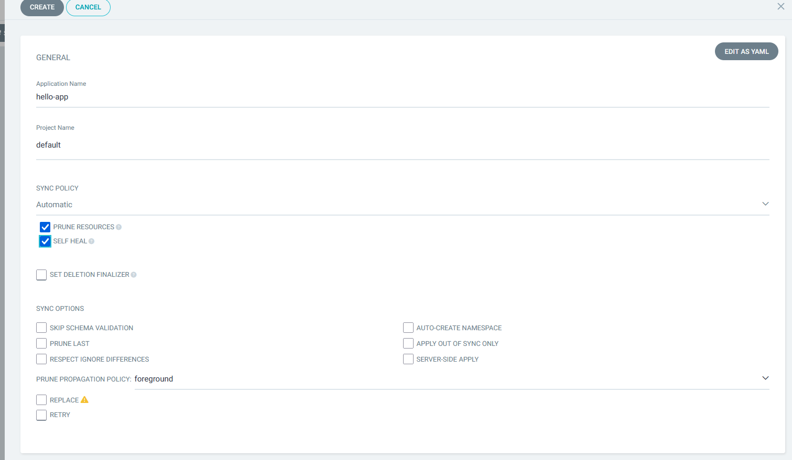
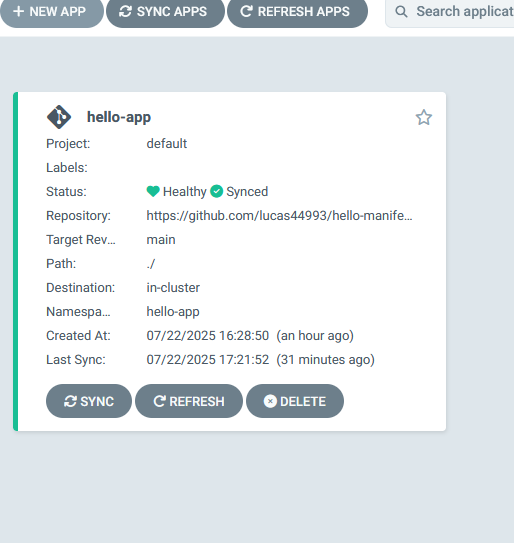
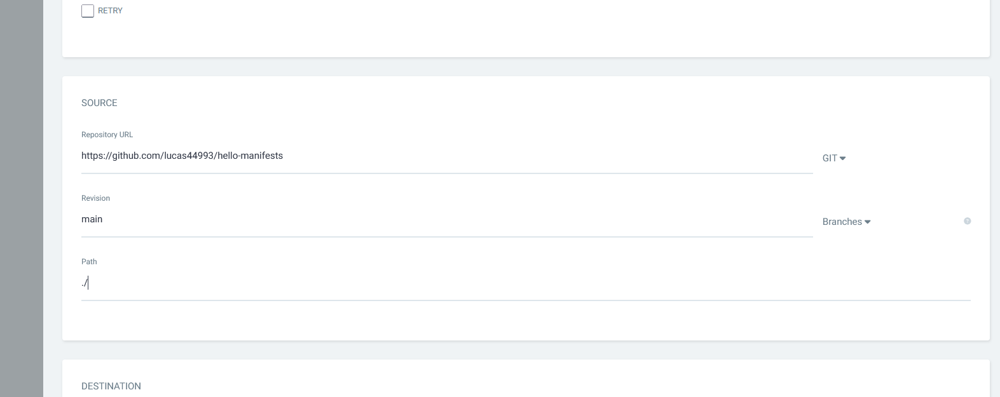
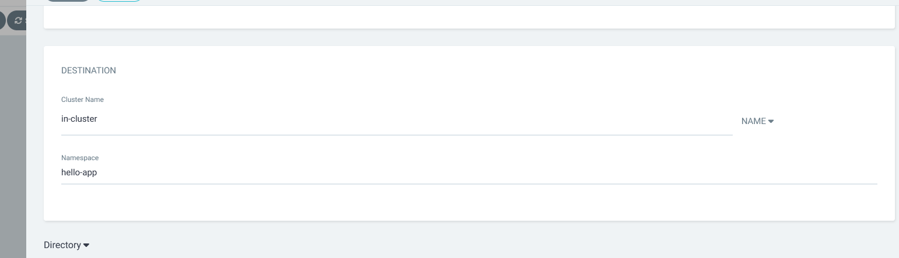
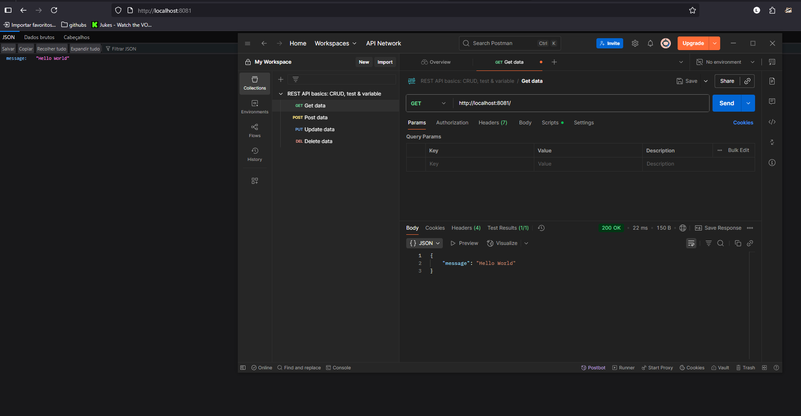
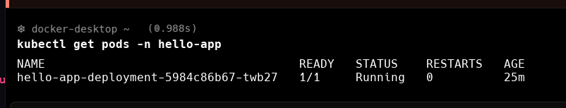
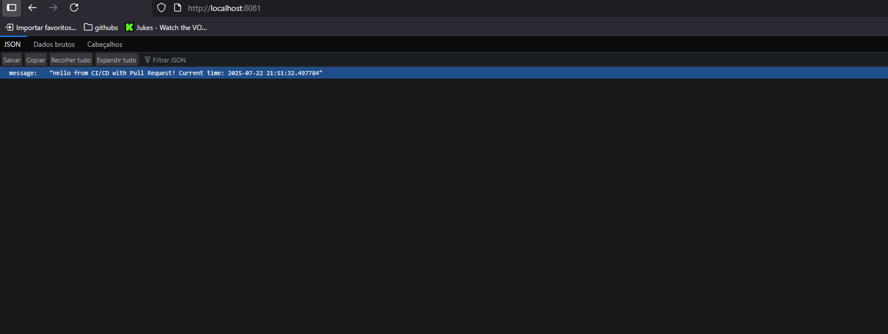

# Projeto CI/CD com GitHub Actions, Docker Hub e ArgoCD

Este README descreve o passo a passo da implementação de um pipeline de Integração Contínua (CI) e Entrega Contínua (CD) para uma aplicação FastAPI. O processo envolve a conteinerização da aplicação, o uso de GitHub Actions para automação, Docker Hub para armazenamento de imagens e ArgoCD para implantação automatizada em um cluster Kubernetes local.

## Sumário

1.  [Pré-requisitos](#1-pré-requisitos)
2.  [Estrutura do Projeto](#2-estrutura-do-projeto)
3.  [Configuração e Implementação](#3-configuração-e-implementação)
    * 3.1. Criar a Aplicação FastAPI
    * 3.2. Configurar o Repositório de Manifestos Kubernetes
    * 3.3. Configurar Segredos no GitHub
    * 3.4. Criar o Workflow de CI/CD com GitHub Actions
    * 3.5. Instalar e Acessar o ArgoCD no Kubernetes
    * 3.6. Criar o `ImagePullSecret` no Cluster
    * 3.7. Criar o Aplicativo no ArgoCD
4.  [Verificação e Teste Final](#4-verificação-e-teste-final)
    * 4.1. Acessar a Aplicação Localmente
    * 4.2. Disparar uma Atualização da Aplicação
5.  [Evidências de Conclusão](#5-evidências-de-conclusão)

---

## 1. Pré-requisitos

Para replicar este projeto, você precisará dos seguintes itens configurados em sua máquina:

* **Conta no GitHub:** Com um repositório público para a aplicação (ex: `hello-app`) e outro para os manifestos (ex: `hello-manifests`).
* **Conta no Docker Hub:** Com um token de acesso para autenticação.
* **Docker Desktop ou Rancher Desktop:** Com o Kubernetes habilitado e em execução.
* **`kubectl`:** Ferramenta de linha de comando para interagir com clusters Kubernetes.
* **Git:** Sistema de controle de versão.
* **Python 3 e Docker:** Ferramentas para desenvolvimento e conteinerização.

## 2. Estrutura do Projeto

O projeto utiliza dois repositórios no GitHub:

* **[`hello-app`](https://github.com/lucas44993/hello-app)**: Repositório da aplicação. Contém o código-fonte FastAPI, `requirements.txt`, `Dockerfile` e o workflow do GitHub Actions.
* **[`hello-manifests`](https://github.com/lucas44993/hello-manifests)**: Repositório GitOps. Contém os manifestos Kubernetes (`deployment.yaml` e `service.yaml`) que definem o estado desejado da aplicação no cluster.

## 3. Configuração e Implementação

### 3.1. Criar a Aplicação FastAPI

1.  Crie o repositório `[SEU_USUARIO_GITHUB]/hello-app` no GitHub e clone-o.
2.  Crie os arquivos `main.py`, `requirements.txt` e `Dockerfile` conforme abaixo no diretório `hello-app`:

    **`main.py`:**
    ```python
    from fastapi import FastAPI

    app = FastAPI()

    @app.get("/")
    async def root():
        return {"message": "Hello World"}
    ```

    **`requirements.txt`:**
    ```
    fastapi
    uvicorn
    ```

    **`Dockerfile`:**
    ```dockerfile
    FROM python:3.9-slim-buster
    WORKDIR /app
    COPY requirements.txt .
    RUN pip install -r requirements.txt
    COPY . .
    CMD ["uvicorn", "main:app", "--host", "0.0.0.0", "--port", "80"]
    ```
3.  Adicione e faça push desses arquivos para o seu repositório `[SEU_USUARIO_GITHUB]/hello-app`.

### 3.2. Configurar o Repositório de Manifestos Kubernetes

1.  Crie o repositório `[SEU_USUARIO_GITHUB]/hello-manifests` no GitHub e clone-o.
2.  Crie os arquivos `deployment.yaml` e `service.yaml` conforme abaixo no diretório `hello-manifests`:

    **`deployment.yaml`:**
    ```yaml
    apiVersion: apps/v1
    kind: Deployment
    metadata:
      name: hello-app-deployment
      labels:
        app: hello-app
    spec:
      replicas: 1
      selector:
        matchLabels:
          app: hello-app
      template:
        metadata:
          labels:
            app: hello-app
        spec:
          containers:
          - name: hello-app
            image: [SEU_USUARIO_DOCKER_HUB]/hello-app:latest
            ports:
            - containerPort: 80
          imagePullSecrets:
          - name: regcred
    ```

    **`service.yaml`:**
    ```yaml
    apiVersion: v1
    kind: Service
    metadata:
      name: hello-app-service
    spec:
      selector:
        app: hello-app
      ports:
        - protocol: TCP
          port: 8080
          targetPort: 80
      type: LoadBalancer
    ```
3.  Adicione e faça push desses arquivos para o seu repositório `[SEU_USUARIO_GITHUB]/hello-manifests`.

### 3.3. Configurar Segredos no GitHub

Para que o GitHub Actions possa interagir com o Docker Hub e seu repositório de manifestos, configure os seguintes segredos no repositório `[SEU_USUARIO_GITHUB]/hello-app` (vá em `Settings` > `Secrets and variables` > `Actions` > `New repository secret`):

* **`DOCKER_USERNAME`**: Seu nome de usuário do Docker Hub.
* **`DOCKER_PASSWORD`**: Seu token de acesso do Docker Hub.
* **`PAT`**: Um Personal Access Token do GitHub com permissão de `repo`.

### 3.4. Criar o Workflow de CI/CD com GitHub Actions

1.  No repositório `[SEU_USUARIO_GITHUB]/hello-app`, crie a pasta `.github/workflows/`.
2.  Dentro dela, crie o arquivo `ci-cd.yaml` com o seguinte conteúdo:

```yaml
name: CI/CD FastAPI

on:
  push:
    branches:
      - main

jobs:
  build-and-deploy:
    runs-on: ubuntu-latest
    steps:
    - name: Checkout code
      uses: actions/checkout@v3

    - name: Log in to Docker Hub
      uses: docker/login-action@v2
      with:
        username: ${{ secrets.DOCKER_USERNAME }}
        password: ${{ secrets.DOCKER_PASSWORD }}

    - name: Build and push Docker image
      id: docker_build
      uses: docker/build-push-action@v4
      with:
        context: .
        push: true
        tags: vege503/hello-app:${{ github.sha }}

    - name: Checkout manifests repository
      uses: actions/checkout@v3
      with:
        repository: lucas44993/hello-manifests
        token: ${{ secrets.PAT }}

    - name: Configure Git for Pull Request
      run: |
        git config --global user.name "github-actions[bot]"
        git config --global user.email "github-actions[bot]@users.noreply.github.com"

    - name: Update image tag in deployment.yaml
      id: update_manifest
      run: |
        sed -i 's|image: vege503/hello-app[:@].*|image: vege503/hello-app@${{ steps.docker_build.outputs.digest }}|g' deployment.yaml
        
        if ! git diff --quiet --exit-code deployment.yaml; then
          echo "changes_detected=true" >> $GITHUB_OUTPUT
          echo "Changes detected in deployment.yaml. Ready to create Pull Request."
        else
          echo "changes_detected=false" >> $GITHUB_OUTPUT
          echo "No changes detected in deployment.yaml. Skipping Pull Request."
        fi

    - name: Create Pull Request
      if: steps.update_manifest.outputs.changes_detected == 'true'
      uses: peter-evans/create-pull-request@v5
      with:
        token: ${{ secrets.PAT }}
        commit-message: "feat(app): Update hello-app image to ${{ steps.docker_build.outputs.digest }}"
        title: "Atualização da Imagem hello-app para novo SHA"
        body: |
          Este Pull Request atualiza a tag da imagem `hello-app` para o novo SHA: `${{ steps.docker_build.outputs.digest }}` no `deployment.yaml`.
          Disparado por push no repositório da aplicação.
        branch: "update-image-tag-${{ github.sha }}" 
        base: "main" 
        delete-branch: true
```

3.  Adicione e faça push do arquivo `ci-cd.yaml` para o seu repositório `[SEU_USUARIO_GITHUB]/hello-app`.

> **Como funciona a atualização automática do manifest:**
>
> Após o build e push da nova imagem Docker, o workflow executa as seguintes etapas:
>
> 1. **Checkout do repositório de manifests:**
>    ```yaml
>    - name: Checkout manifests repository
>      uses: actions/checkout@v3
>      with:
>        repository: lucas44993/hello-manifests
>        token: ${{ secrets.PAT }}
>    ```
>    O workflow faz o checkout do repositório [`hello-manifests`](https://github.com/lucas44993/hello-manifests) usando um token de acesso pessoal (PAT) para permitir alterações e criação de Pull Requests.
>
> 2. **Configuração do Git para Pull Request:**
>    ```yaml
>    - name: Configure Git for Pull Request
>      run: |
>        git config --global user.name "github-actions[bot]"
>        git config --global user.email "github-actions[bot]@users.noreply.github.com"
>    ```
>    Define o nome e e-mail do usuário git para que os commits e Pull Requests sejam atribuídos ao bot do GitHub Actions.
>
> 3. **Atualização do deployment.yaml:**
>    ```yaml
>    - name: Update image tag in deployment.yaml
>      id: update_manifest
>      run: |
>        sed -i 's|image: vege503/hello-app[:@].*|image: vege503/hello-app@${{ steps.docker_build.outputs.digest }}|g' deployment.yaml
>        
>        if ! git diff --quiet --exit-code deployment.yaml; then
>          echo "changes_detected=true" >> $GITHUB_OUTPUT
>          echo "Changes detected in deployment.yaml. Ready to create Pull Request."
>        else
>          echo "changes_detected=false" >> $GITHUB_OUTPUT
>          echo "No changes detected in deployment.yaml. Skipping Pull Request."
>        fi
>    ```
>    Atualiza a referência da imagem Docker no arquivo `deployment.yaml` para o novo digest gerado no build. Se houver alteração, sinaliza que um Pull Request deve ser criado.
>
> 4. **Criação automática do Pull Request:**
>    ```yaml
>    - name: Create Pull Request
>      if: steps.update_manifest.outputs.changes_detected == 'true'
>      uses: peter-evans/create-pull-request@v5
>      with:
>        token: ${{ secrets.PAT }}
>        commit-message: "feat(app): Update hello-app image to ${{ steps.docker_build.outputs.digest }}"
>        title: "Atualização da Imagem hello-app para novo SHA"
>        body: |
>          Este Pull Request atualiza a tag da imagem `hello-app` para o novo SHA: `${{ steps.docker_build.outputs.digest }}` no `deployment.yaml`.
>          Disparado por push no repositório da aplicação.
>        branch: "update-image-tag-${{ github.sha }}" 
>        base: "main" 
>        delete-branch: true
>    ```
>    Se houver alteração, um Pull Request é criado automaticamente para revisão e merge, garantindo rastreabilidade e controle das atualizações de versão no cluster Kubernetes.
>
> 

### 3.5. Instalar e Acessar o ArgoCD no Kubernetes

1.  Crie o namespace para o ArgoCD no seu cluster:
    ```bash
    kubectl create namespace argocd
    ```
2.  Instale o ArgoCD usando o manifesto oficial:
    ```bash
    kubectl apply -n argocd -f [https://raw.githubusercontent.com/argoproj/argo-cd/stable/manifests/install.yaml](https://raw.githubusercontent.com/argoproj/argo-cd/stable/manifests/install.yaml)
    ```
3.  Aguarde a inicialização dos pods do ArgoCD e verifique seu status:
    ```bash
    kubectl get pods -n argocd
    ```
    **[IMAGEM 1: `kubectl get pods -n argocd` mostrando todos os pods "Running" e "Ready"]**
4.  Acesse a interface web do ArgoCD. Mantenha este comando rodando em um terminal:
    ```bash
    kubectl port-forward svc/argocd-server -n argocd 8080:443
    ```
    Abra seu navegador e acesse `https://localhost:8080`.
5.  Obtenha a senha inicial de login do ArgoCD:
    ```bash
    kubectl get secret argocd-initial-admin-secret -n argocd -o jsonpath="{.data.password}" | base64 -d; echo
    ```
6.  Faça login na interface do ArgoCD com o usuário `admin` e a senha obtida.

### 3.6. Criar o `ImagePullSecret` no Cluster

1.  Crie o namespace para sua aplicação no Kubernetes:
    ```bash
    kubectl create namespace hello-app
    ```
2.  Crie um `ImagePullSecret` para permitir que o Kubernetes puxe imagens do seu Docker Hub:
    ```bash
    kubectl create secret docker-registry regcred \
      --docker-server=docker.io \
      --docker-username=[SEU_USUARIO_DOCKER_HUB] \
      --docker-password=[SEU_TOKEN_DOCKER_HUB] \
      --docker-email=[SEU_EMAIL_DOCKER_HUB] \
      -n hello-app
    ```

### 3.7. Criar o Aplicativo no ArgoCD

1.  Na interface web do ArgoCD, clique em **"New App"**.
2.  Preencha os campos da seguinte forma:
    * **General:**
        * **Application Name:** `hello-app`
        * **Project:** `default`
    * **Source:**
        * **Repository URL:** `https://github.com/lucas44993/hello-manifests.git`
        * **Revision:** `main`
        * **Path:** `./`
    * **Destination:**
        * **Cluster:** `in-cluster`
        * **Namespace:** `hello-app`
    * **Sync Policy:**
        * Marque **`Automatic`**.
        * Marque **`Prune`**.
        * Marque **`Self Heal`**.
3.  Clique em **"Create"**.

    

    

    

## 4. Verificação e Teste Final

### 4.1. Acessar a Aplicação Localmente

1.  No terminal, verifique o status do pod da sua aplicação:
    ```bash
    kubectl get pods -n hello-app
    ```
    
2.  Encaminhe a porta do serviço para sua máquina local. Mantenha este comando rodando em um terminal:
    ```bash
    kubectl port-forward service/hello-app-service 8080:8080 -n hello-app
    ```
3.  Abra seu navegador e acesse: `http://localhost:8080/`
    Você deve ver a mensagem "Hello World".
    

### 4.2. Disparar uma Atualização da Aplicação

1.  No seu repositório `[SEU_USUARIO_GITHUB]/hello-app`, edite o arquivo `main.py` e altere a mensagem, por exemplo:
    ```python
    from fastapi import FastAPI
    import datetime

    app = FastAPI()

    @app.get("/")
    async def root():
        return {"message": f"Hello from CI/CD with ArgoCD! Updated at {datetime.datetime.now()}"}
    ```
2.  Adicione e faça push da alteração para o GitHub:
    ```bash
    git add main.py
    git commit -m "Update message for CI/CD test"
    git push origin main
    ```
3.  **Monitore o GitHub Actions:**
    Vá para a aba "Actions" no seu repositório `[SEU_USUARIO_GITHUB]/hello-app`. Observe o workflow ser disparado, construindo uma nova imagem e atualizando o `deployment.yaml` no repositório `[SEU_USUARIO_GITHUB]/hello-manifests`.
    **[IMAGEM 6: Tela do GitHub Actions mostrando o workflow de CI/CD concluído com sucesso]**
4.  **Monitore o ArgoCD:**
    Na interface do ArgoCD, observe a aplicação `hello-app` transicionar para "Out Of Sync" e depois de volta para "Synced" (e "Healthy"), indicando que a nova versão foi implantada.
    **[IMAGEM 7: Tela do ArgoCD mostrando a transição de status para "Synced" após a atualização]**
5.  **Verifique a Aplicação Atualizada:**
    Com o `kubectl port-forward` ainda rodando, atualize a página no seu navegador (`http://localhost:8080/`). A mensagem deve ter sido atualizada.
    **[IMAGEM 8: Captura de tela do navegador mostrando a nova mensagem atualizada]**

## 5. Evidências de Conclusão

* ☑ **Link do repositório Git com a aplicação FastAPI + Dockerfile + GitHub Actions:**
    * https://github.com/lucas44993/hello-app
* ☑ **Link do repositório com os manifests (deployment.yaml, service.yaml):**
    * https://github.com/lucas44993/hello-manifests
* ☑ **Captura de tela do ArgoCD com a aplicação sincronizada:**
    * 
* ☑ **Print do `kubectl get pods` com a aplicação rodando:**
    * 
* ☑ **Print da resposta da aplicação via `curl` ou navegador (antes e depois da atualização):**
    * 
    * 